# How the skills connect

Generated from the skills by `docs/build-graphs.py`; edit the skills, then run it. One graph per entry point in `always-on.md`: each section of the skill is a box, its numbered steps run top to bottom, and a dashed arrow marks where a step hands over to another skill.

## Which skill hands over to which

| Skill | Hands over to |
|---|---|
| `converge` | nothing |
| `core` | `writing`, `open-issue`, `github-threads`, `evidence`, `delegating`, `design-loop`, `converge`, `pull-request`, `merging` |
| `delegating` | nothing |
| `design-loop` | `pull-request`, `core`, `review`, `writing`, `converge`, `delegating` |
| `docs` | `review`, `converge` |
| `evidence` | nothing |
| `finality` | nothing |
| `github-threads` | `writing`, `converge`, `review`, `refactor`, `core`, `pull-request`, `finality` |
| `guardian` | `delegating`, `converge`, `refactor`, `design-loop`, `core`, `writing` |
| `mechanisms` | nothing |
| `merging` | nothing |
| `open-issue` | `core`, `evidence`, `writing`, `github-threads` |
| `past-failures` | nothing |
| `pull-request` | `evidence`, `delegating`, `core`, `finality`, `converge`, `guardian`, `design-loop`, `writing`, `docs`, `open-issue`, `mechanisms` |
| `refactor` | nothing |
| `review` | `core`, `delegating`, `guardian`, `refactor`, `mechanisms`, `writing`, `github-threads`, `converge` |
| `verify` | `core`, `converge` |
| `writing` | `github-threads`, `mechanisms` |

## Any multi-step or GitHub task, first

Opens `mergeworthy:core` (the task, triage 1.0, principles 1.1, tracking 1.2, discovery 1.3 (docs, style), safety 1.8, pre-flight 1.12).

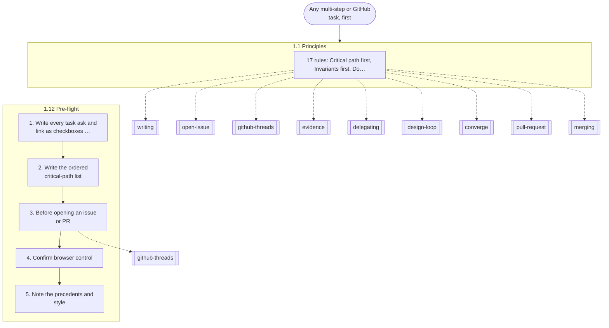

## Writing anything a person reads: a comment, reply or edit, a PR or issue body, a design answer, a report to the user

Opens `mergeworthy:writing` (every writing rule 1.11: voice, model replies, budgets, the badge).

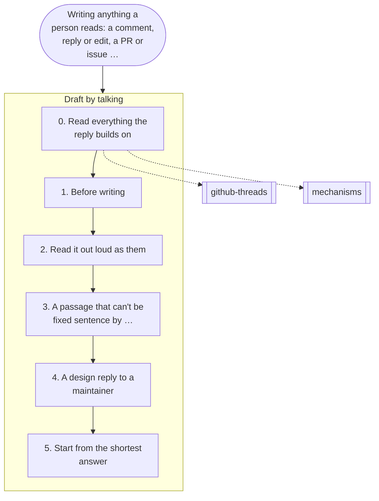

## Designing an API, protocol or module, or restructuring code

Opens `mergeworthy:design-loop` (1.4).

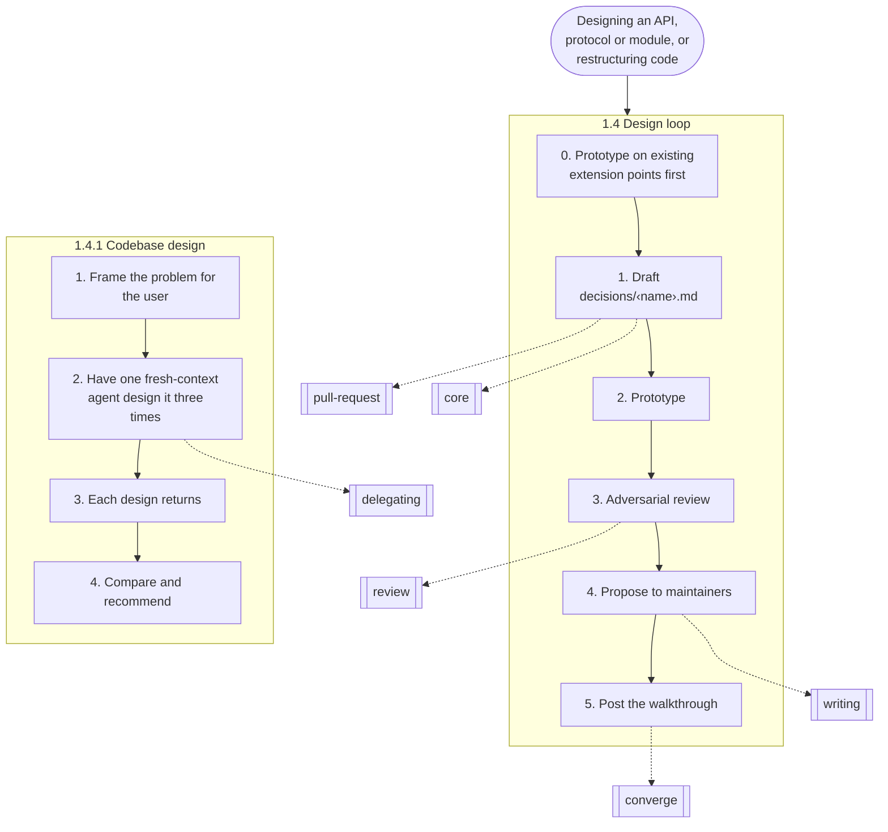

## Any GitHub thread you're in, and anything you post

Opens `mergeworthy:github-threads` (the live loop 1.5 (with its convergence step for design threads), the posting gate 1.6).

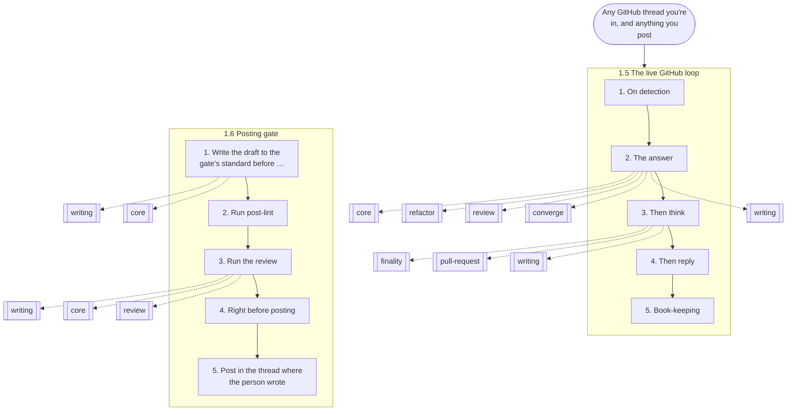

## Pushing, saying a PR is ready, merging

Opens `mergeworthy:merging` (1.7).

## Writing skills, rules or prompts; starting or briefing subagents; taking over another session's work

Opens `mergeworthy:delegating` (1.9, 1.10).

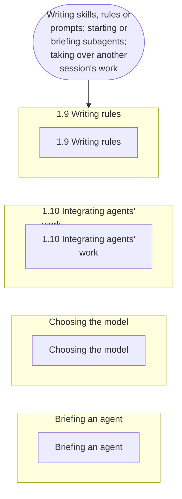

## Any change that lands in a PR: writing it, committing it, pushing it to an open PR

Opens `mergeworthy:pull-request` (the steps to a merge-ready PR).

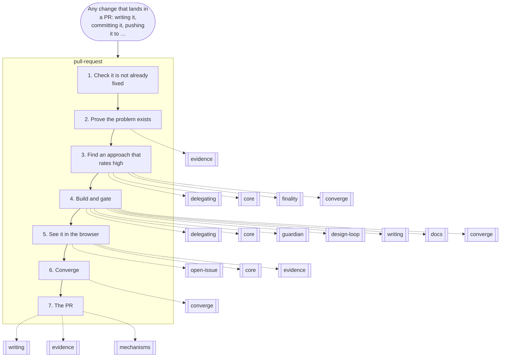

## Writing or changing docs: a docs page, a README, JSDoc or an `llms.txt` line a user reads

Opens `mergeworthy:docs` (the project's docs voice, placement, shape, drafting from a sibling page, the fresh-reader check).

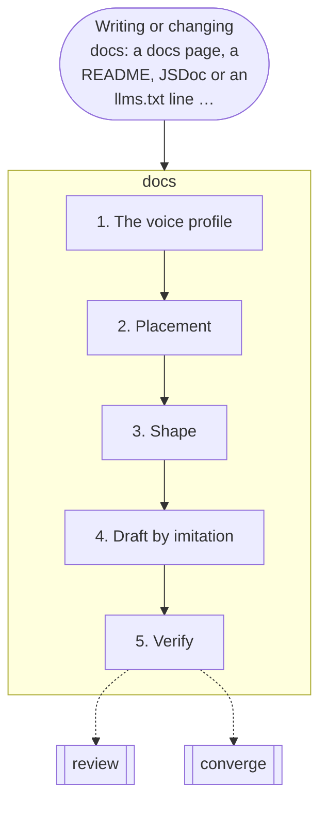

## Opening an issue

Opens `mergeworthy:open-issue` (one finding a newcomer can find, reproduce and judge).

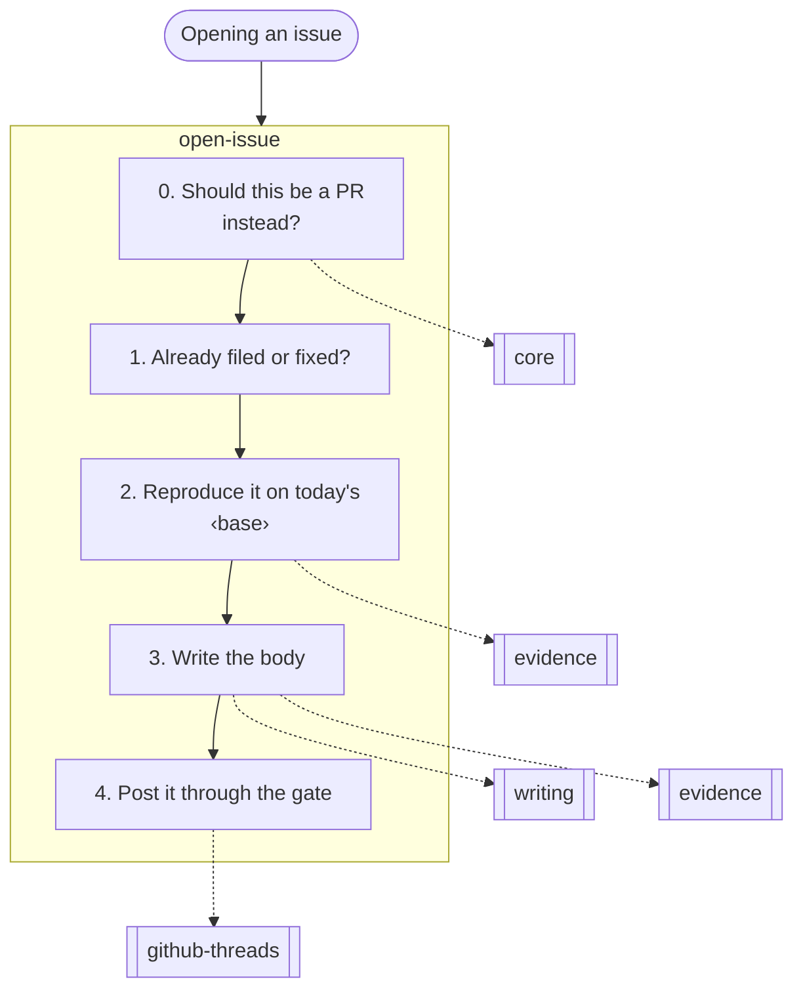

## Showing a behavior: a reproduction, a screenshot, a video

Opens `mergeworthy:evidence` (reproducing it as a person would, capturing it, uploading it).

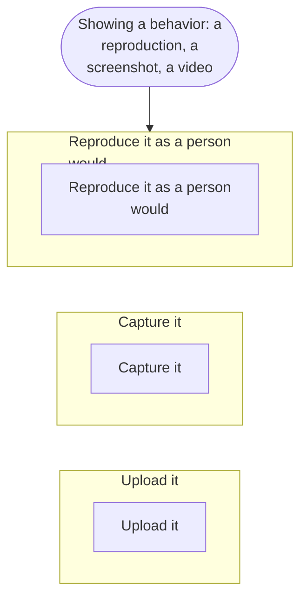

## Converging a PR, before it's ready (every tier)

Opens `mergeworthy:converge` (the pipeline every PR runs: finality, Loop A, Loop B, the fresh reader, gates).

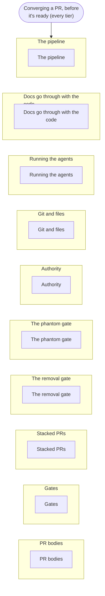

## Bug verification, reproduce-only

Opens `mergeworthy:verify` (Loop A (bug verification)).

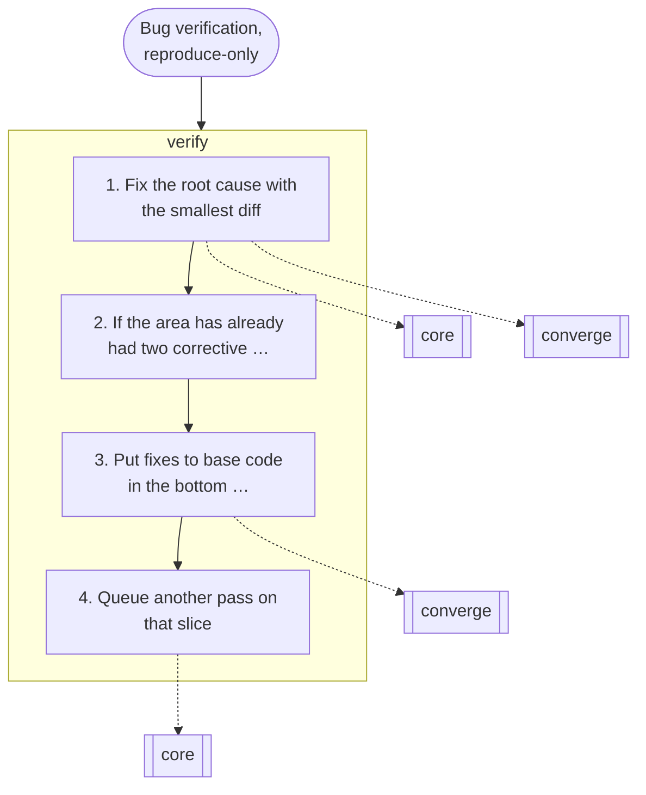

## Bloat and quality rounds

Opens `mergeworthy:guardian` (the guardian charter, Loop B (bloat and quality)).

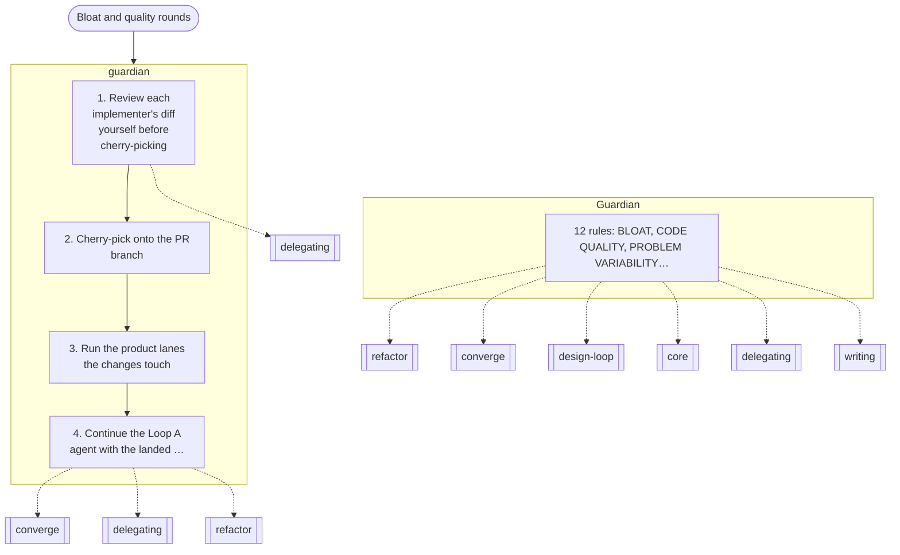

## The refactor pass

Opens `mergeworthy:refactor` (the pinnacle split + simplify prompt).

## Code drifted through many patches; a design thread drifted over many rounds; stuck with every option costing something ruled out; asked for the ideal design (brainstorm, perfect world, pinnacle)

Opens `mergeworthy:finality` (the finality pass).

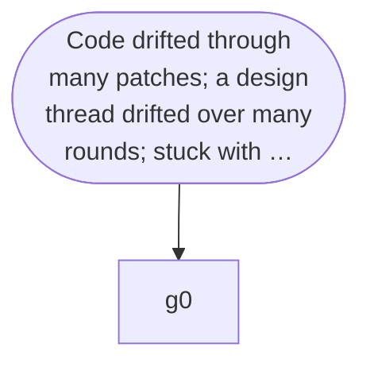

## Any independent review

Opens `mergeworthy:review` (who reviews, the reviewer charter).

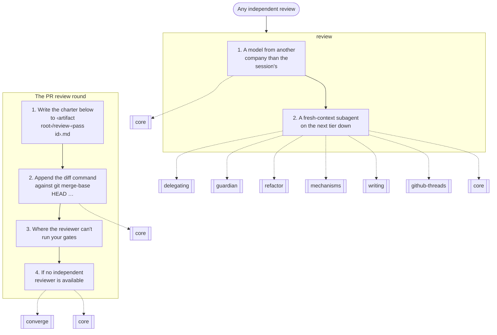

## A rule failed, or the user names a failure

Opens `mergeworthy:past-failures` (the table of past failures and the rule for each).

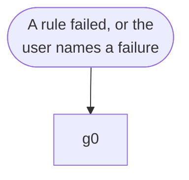

## Using or fixing the scripts and hooks

Opens `mergeworthy:mechanisms` (the watcher, the hooks, `gate-pass`, `post-lint`, `pr-steps`).

```mermaid
flowchart TB
  start(["Using or fixing the<br/>scripts and hooks"])
  subgraph g0["Commands"]
    s0["Commands"]
  end
  subgraph g1["gh-watch-start"]
    s1["gh-watch-start"]
  end
  subgraph g2["post-lint"]
    s2["post-lint"]
  end
  subgraph g3["thread-context"]
    s3["thread-context"]
  end
  subgraph g4["gate-pass"]
    s4["gate-pass"]
  end
  subgraph g5["review-context"]
    s5["review-context"]
  end
  subgraph g6["loc-breakdown"]
    s6["loc-breakdown"]
  end
  subgraph g7["The finality trigger"]
    s7["The finality trigger"]
  end
  subgraph g8["pr-steps"]
    s8["pr-steps"]
  end
  subgraph g9["The watcher daemon"]
    s9["The watcher daemon"]
  end
  subgraph g10["Hooks"]
    s10["Hooks"]
  end
  subgraph g11["pre-bash-guard.py"]
    s11["pre-bash-guard.py"]
  end
  subgraph g12["post-bash-register.py"]
    s12["post-bash-register.py"]
  end
  subgraph g13["stop-lint.py"]
    s13["stop-lint.py"]
  end
  subgraph g14["session-start"]
    s14["session-start"]
  end
  start --> g0
  g0 ~~~ g1
  g1 ~~~ g2
  g2 ~~~ g3
  g3 ~~~ g4
  g4 ~~~ g5
  g5 ~~~ g6
  g6 ~~~ g7
  g7 ~~~ g8
  g8 ~~~ g9
  g9 ~~~ g10
  g10 ~~~ g11
  g11 ~~~ g12
  g12 ~~~ g13
  g13 ~~~ g14
```
