# How the skills connect

Generated from the skills by `docs/build-graphs.py`; edit the skills, then run it. One graph per entry point in `always-on.md`: each section of the skill is a box, its numbered steps run top to bottom, and a dashed arrow marks where a step hands over to another skill.

## Which skill hands over to which

| Skill | Hands over to |
|---|---|
| `converge` | `verify`, `guardian`, `refactor`, `finality` |
| `core` | `implement-issue`, `delegating`, `merging`, `github-threads`, `converge` |
| `delegating` | nothing |
| `design-loop` | `implement-issue`, `core`, `review`, `github-threads`, `converge` |
| `finality` | nothing |
| `github-threads` | `review`, `refactor`, `core`, `implement-issue`, `mechanisms` |
| `guardian` | `design-loop` |
| `implement-issue` | `finality`, `guardian`, `converge`, `design-loop`, `core` |
| `mechanisms` | nothing |
| `merging` | nothing |
| `past-failures` | nothing |
| `refactor` | nothing |
| `review` | `guardian`, `refactor`, `github-threads`, `core` |
| `verify` | `converge`, `core` |

## Any multi-step or GitHub task, first

Opens `mergeworthy:core` (the task, triage 1.0, principles 1.1, tracking 1.2, discovery 1.3, safety 1.8, reporting 1.11, pre-flight 1.12).

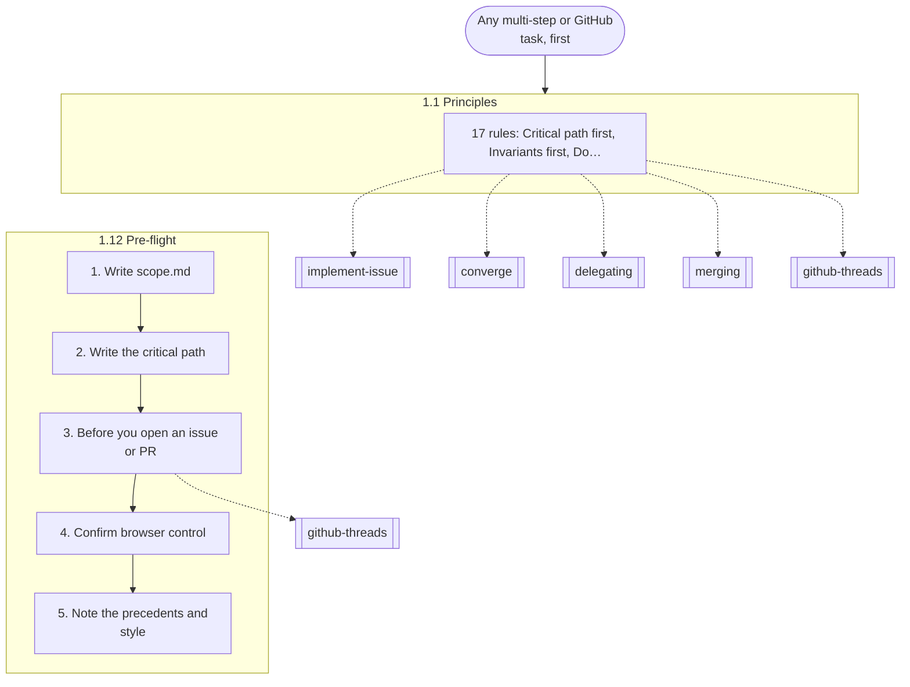

## Designing an API, protocol or module, or restructuring code

Opens `mergeworthy:design-loop` (1.4).

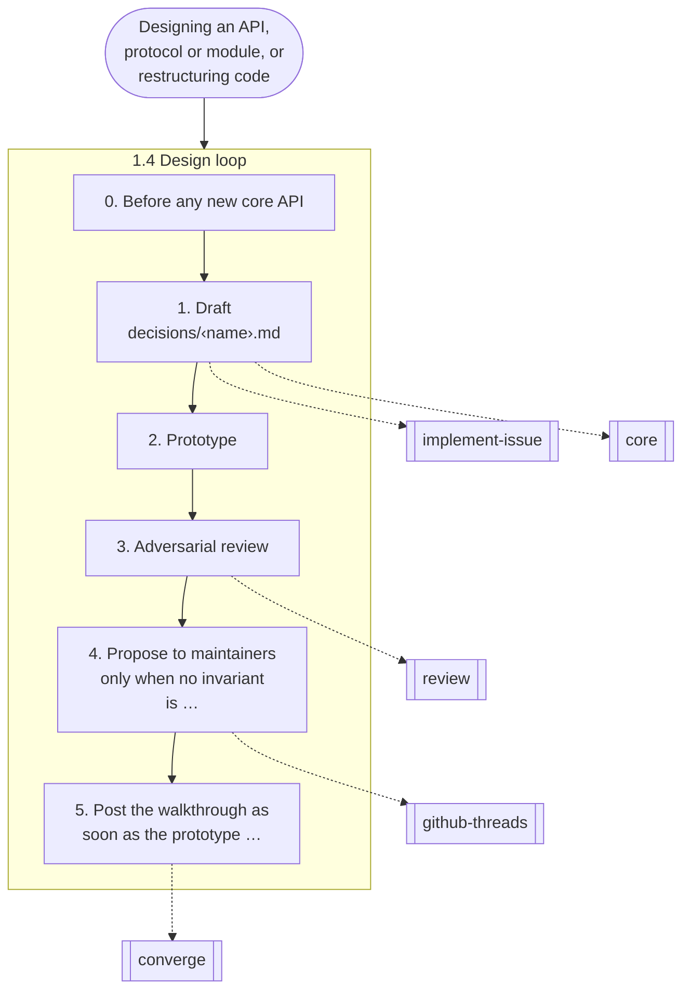

## Any GitHub thread you're in, and anything you post

Opens `mergeworthy:github-threads` (the live loop 1.5, the posting gate 1.6).

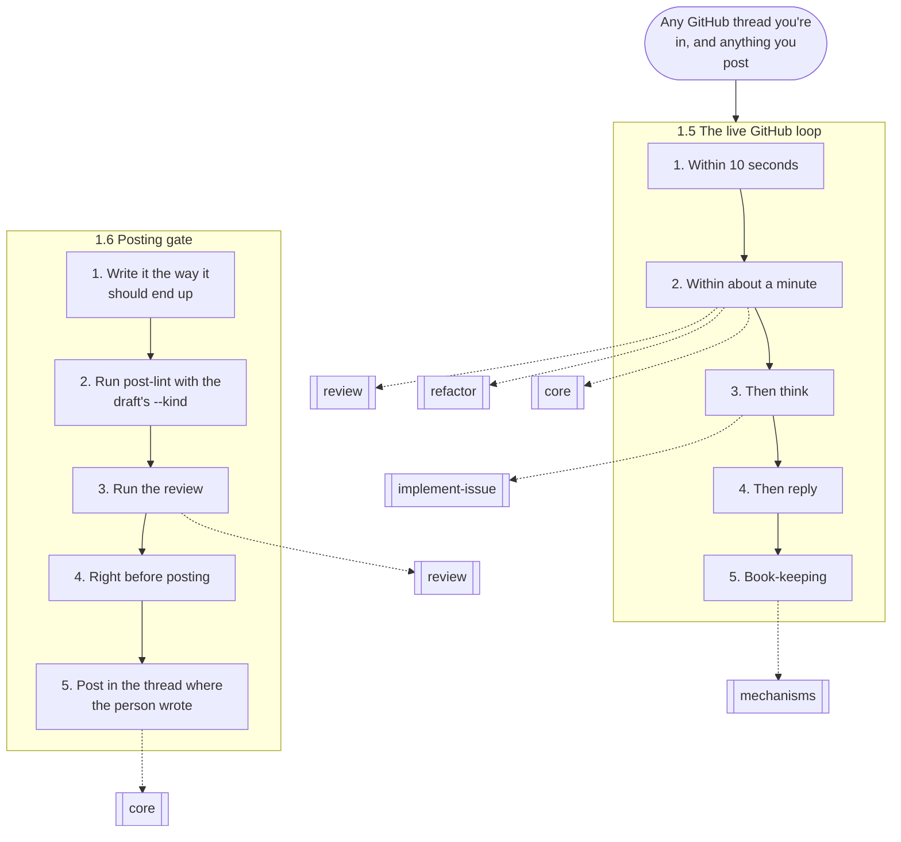

## Pushing, saying a PR is ready, merging

Opens `mergeworthy:merging` (1.7).

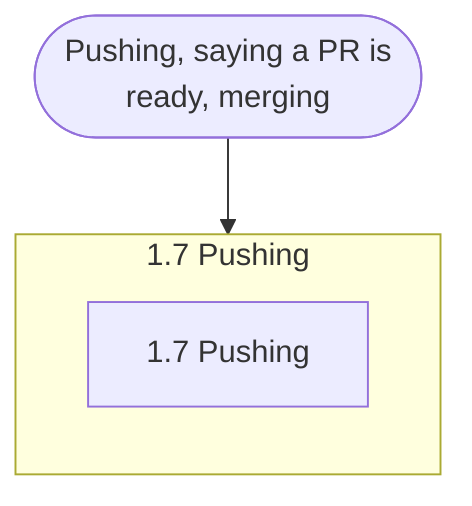

## Writing rules, prompts or docs; starting or briefing subagents

Opens `mergeworthy:delegating` (1.9, 1.10).

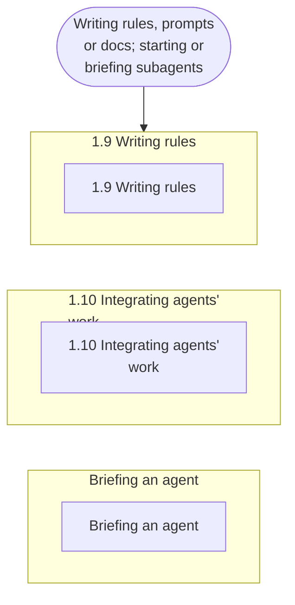

## Implementing an issue or opening a PR

Opens `mergeworthy:implement-issue` (Part 2).

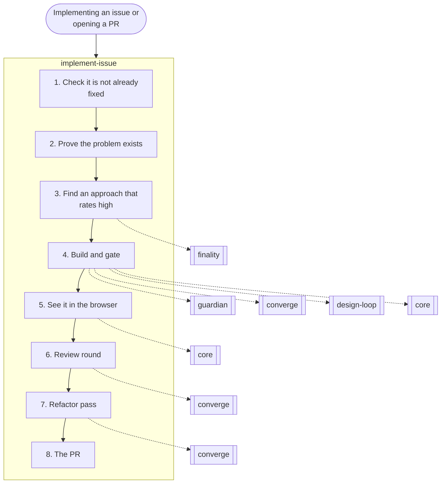

## Converging a PR (the owner asks, or Tier ≥ M before ready)

Opens `mergeworthy:converge` (Part 3, through the passes below).

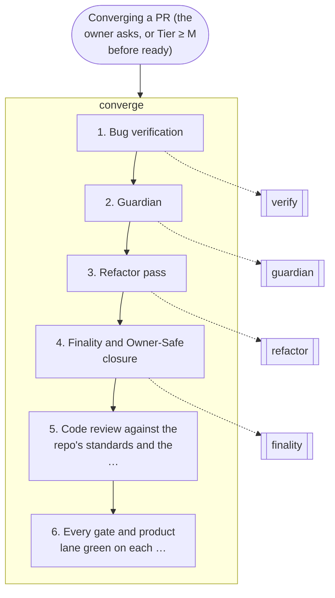

## Bug verification, reproduce-only

Opens `mergeworthy:verify` (Loop A).

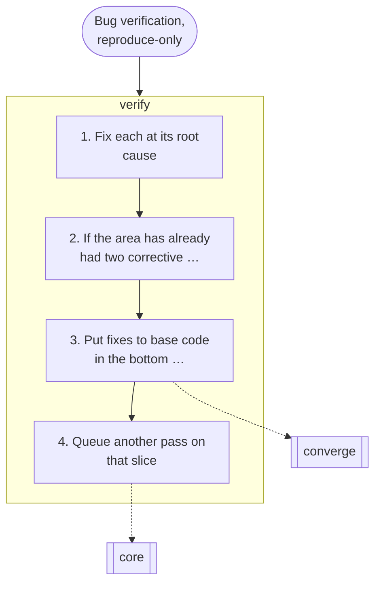

## Bloat and quality rounds

Opens `mergeworthy:guardian` (the LeanKeeper charter, Loop B).

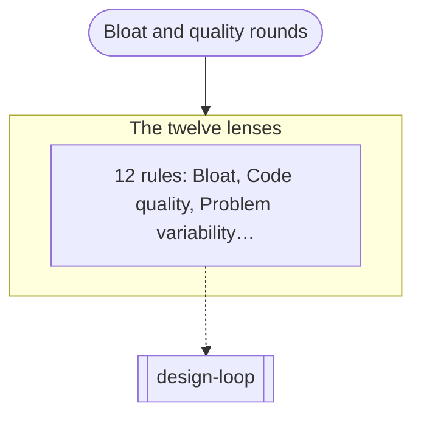

## The refactor pass

Opens `mergeworthy:refactor` (the pinnacle split + simplify prompt).

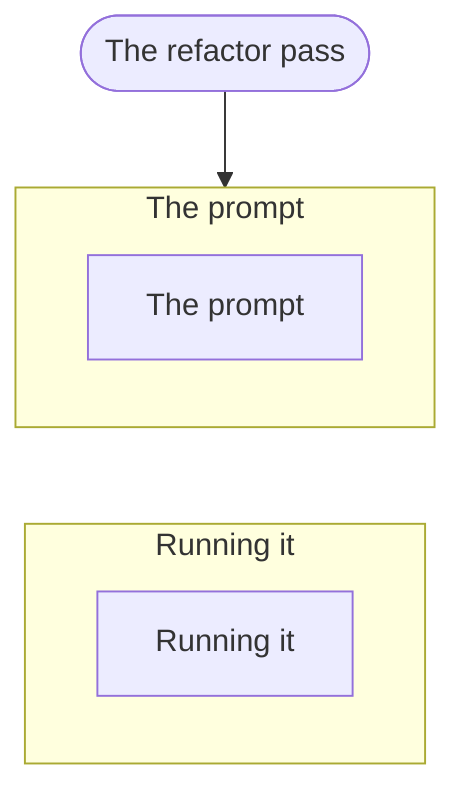

## Code drifted through many patches

Opens `mergeworthy:finality` (the finality pass).

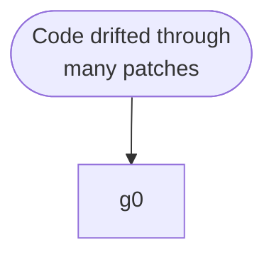

## Any independent review

Opens `mergeworthy:review` (who reviews, the reviewer charter).

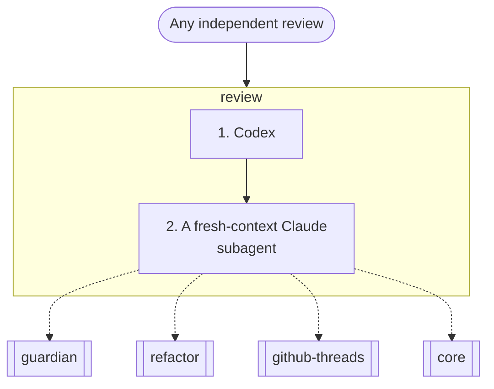

## A rule failed, or the user names a failure

Opens `mergeworthy:past-failures` (Part 4).

## Using or fixing the scripts and hooks

Opens `mergeworthy:mechanisms` (Part 5).

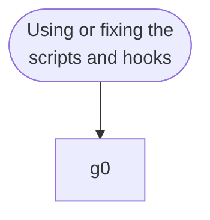
