# How the skills connect

Generated from the skills by `docs/build-graphs.py`; edit the skills, then run it. One graph per entry point in `always-on.md`: each section of the skill is a box, its numbered steps run top to bottom, and a dashed arrow marks where a step hands over to another skill.

## Which skill hands over to which

| Skill | Hands over to |
|---|---|
| `code` | `delegate` |
| `converge` | `design`, `finality`, `delegate`, `task`, `code`, `writing`, `pull-request`, `rules`, `post`, `merging` |
| `delegate` | `code`, `writing` |
| `design` | `delegate`, `pull-request`, `code`, `finality`, `writing`, `post`, `converge` |
| `docs` | `delegate`, `converge`, `code` |
| `evidence` | `post` |
| `finality` | `delegate`, `code`, `post`, `design`, `converge` |
| `merging` | `code`, `converge`, `post`, `task`, `writing` |
| `open-issue` | `pull-request`, `task`, `delegate`, `evidence`, `writing`, `post` |
| `post` | `pull-request`, `open-issue`, `writing`, `delegate`, `task` |
| `pull-request` | `delegate`, `post`, `evidence`, `design`, `finality`, `code`, `task`, `docs`, `converge`, `merging`, `writing`, `reply` |
| `reply` | `post`, `converge`, `design`, `merging`, `delegate`, `task` |
| `review` | `delegate`, `code`, `post`, `writing` |
| `rules` | `task`, `open-issue`, `delegate`, `reply` |
| `steward` | `rules`, `delegate`, `writing` |
| `task` | `post`, `pull-request`, `design`, `reply`, `review`, `open-issue`, `docs`, `writing`, `delegate` |
| `writing` | nothing |

## Any multi-step or GitHub task, first; an `/ai` or `/agent` command

Opens `mergeworthy:task` (triage, scope, the project file, the watcher, then the deliverable's skill (10 steps)).

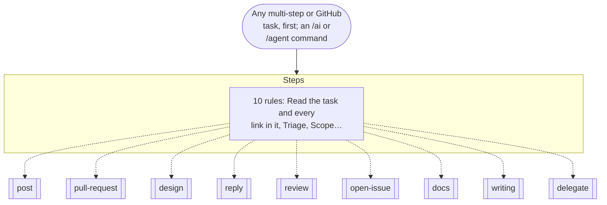
```mermaid
flowchart TB
  start(["Any multi-step or GitHub<br/>task, first; an /ai or<br/>/agent command"])
  subgraph g0["Steps"]
    s0["10 rules: Read the task and every<br/>link in it, Triage, Scope…"]
  end
  s0 -.-> r1[["post"]]
  s0 -.-> r2[["pull-request"]]
  s0 -.-> r3[["design"]]
  s0 -.-> r4[["reply"]]
  s0 -.-> r5[["review"]]
  s0 -.-> r6[["open-issue"]]
  s0 -.-> r7[["docs"]]
  s0 -.-> r8[["writing"]]
  s0 -.-> r9[["delegate"]]
  start --> g0
```

## A change that will land in a PR: from an issue or not, until it merges

Opens `mergeworthy:pull-request` (worktree to ready PR (12 steps)).

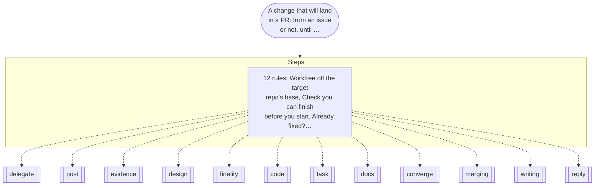
```mermaid
flowchart TB
  start(["A change that will land<br/>in a PR: from an issue<br/>or not, until …"])
  subgraph g0["Steps"]
    s0["12 rules: Worktree off the target<br/>repo's base, Check you can finish<br/>before you start, Already fixed?…"]
  end
  s0 -.-> r1[["delegate"]]
  s0 -.-> r2[["post"]]
  s0 -.-> r3[["evidence"]]
  s0 -.-> r4[["design"]]
  s0 -.-> r5[["finality"]]
  s0 -.-> r6[["code"]]
  s0 -.-> r7[["task"]]
  s0 -.-> r8[["docs"]]
  s0 -.-> r9[["converge"]]
  s0 -.-> r10[["merging"]]
  s0 -.-> r11[["writing"]]
  s0 -.-> r12[["reply"]]
  start --> g0
```

## Woken by the Monitor; a comment to answer; any watcher event

Opens `mergeworthy:reply` (the event table, then the answer (8 steps)).

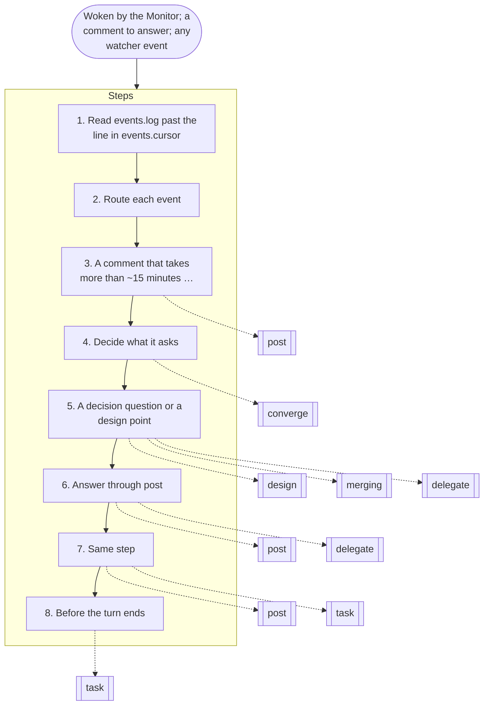
```mermaid
flowchart TB
  start(["Woken by the Monitor; a<br/>comment to answer; any<br/>watcher event"])
  subgraph g0["Steps"]
    s0["1. Read events.log past the<br/>line in events.cursor"]
    s1["2. Route each event"]
    s0 --> s1
    s2["3. A comment that takes<br/>more than ~15 minutes …"]
    s1 --> s2
    s3["4. Decide what it asks"]
    s2 --> s3
    s4["5. A decision question or a<br/>design point"]
    s3 --> s4
    s5["6. Answer through post"]
    s4 --> s5
    s6["7. Same step"]
    s5 --> s6
    s7["8. Before the turn ends"]
    s6 --> s7
  end
  s2 -.-> r1[["post"]]
  s3 -.-> r2[["converge"]]
  s4 -.-> r3[["design"]]
  s4 -.-> r4[["merging"]]
  s4 -.-> r5[["delegate"]]
  s5 -.-> r6[["post"]]
  s5 -.-> r7[["delegate"]]
  s6 -.-> r8[["post"]]
  s6 -.-> r9[["task"]]
  s7 -.-> r10[["task"]]
  start --> g0
```

## A design question, designing an API, protocol or module, restructuring code, your own proposal

Opens `mergeworthy:design` (goal, debate, design it twice, prototype, propose (9 steps)).

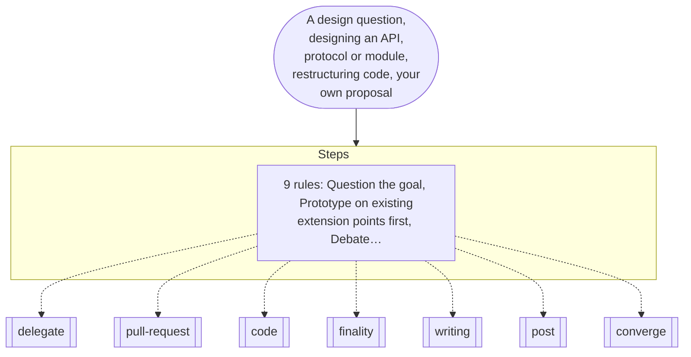
```mermaid
flowchart TB
  start(["A design question,<br/>designing an API,<br/>protocol or module,<br/>restructuring code, your<br/>own proposal"])
  subgraph g0["Steps"]
    s0["9 rules: Question the goal, Prototype on existing<br/>extension points first, Debate…"]
  end
  s0 -.-> r1[["delegate"]]
  s0 -.-> r2[["pull-request"]]
  s0 -.-> r3[["code"]]
  s0 -.-> r4[["finality"]]
  s0 -.-> r5[["writing"]]
  s0 -.-> r6[["post"]]
  s0 -.-> r7[["converge"]]
  start --> g0
```

## Reviewing a PR you didn't write, or any standalone review

Opens `mergeworthy:review` (an independent reviewer, findings settled by runs (4 steps)).

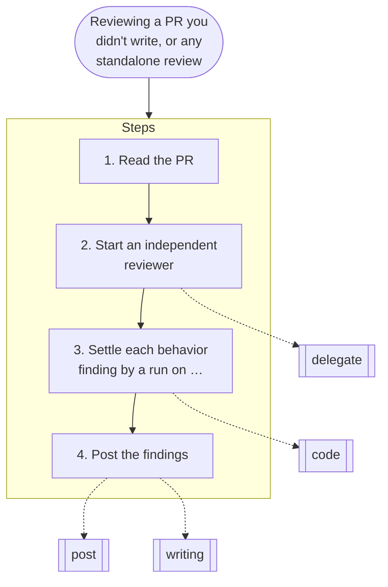
```mermaid
flowchart TB
  start(["Reviewing a PR you<br/>didn't write, or any<br/>standalone review"])
  subgraph g0["Steps"]
    s0["1. Read the PR"]
    s1["2. Start an independent<br/>reviewer"]
    s0 --> s1
    s2["3. Settle each behavior<br/>finding by a run on …"]
    s1 --> s2
    s3["4. Post the findings"]
    s2 --> s3
  end
  s1 -.-> r1[["delegate"]]
  s2 -.-> r2[["code"]]
  s3 -.-> r3[["post"]]
  s3 -.-> r4[["writing"]]
  start --> g0
```

## Opening an issue

Opens `mergeworthy:open-issue` (already filed?, reproduce, body, post (5 steps)).

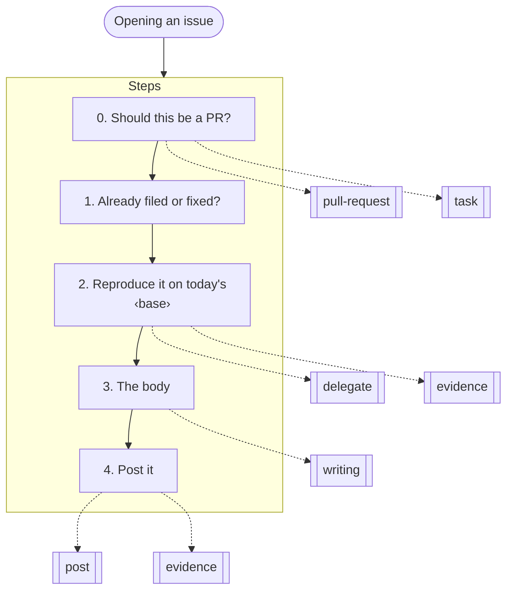
```mermaid
flowchart TB
  start(["Opening an issue"])
  subgraph g0["Steps"]
    s0["0. Should this be a PR?"]
    s1["1. Already filed or fixed?"]
    s0 --> s1
    s2["2. Reproduce it on today's<br/>‹base›"]
    s1 --> s2
    s3["3. The body"]
    s2 --> s3
    s4["4. Post it"]
    s3 --> s4
  end
  s0 -.-> r1[["pull-request"]]
  s0 -.-> r2[["task"]]
  s2 -.-> r3[["delegate"]]
  s2 -.-> r4[["evidence"]]
  s3 -.-> r5[["writing"]]
  s4 -.-> r6[["post"]]
  s4 -.-> r7[["evidence"]]
  start --> g0
```

## Writing or changing docs a user reads: a page, a README, JSDoc, an `llms.txt` line

Opens `mergeworthy:docs` (profile, placement, imitate, the docs reader (5 steps)).

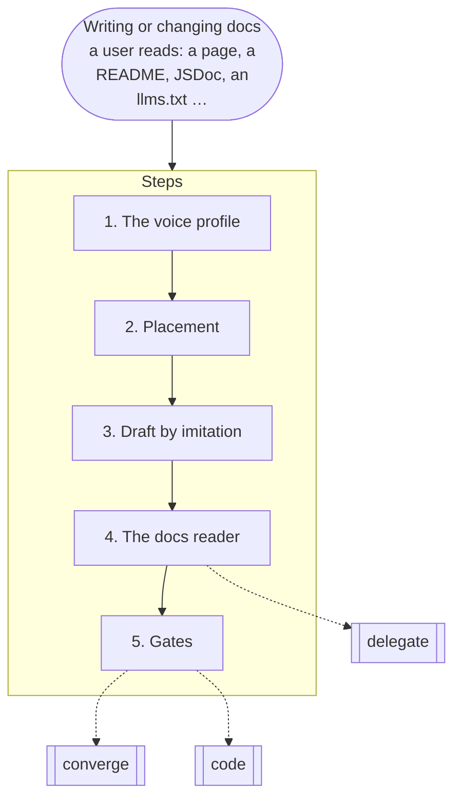
```mermaid
flowchart TB
  start(["Writing or changing docs<br/>a user reads: a page, a<br/>README, JSDoc, an<br/>llms.txt …"])
  subgraph g0["Steps"]
    s0["1. The voice profile"]
    s1["2. Placement"]
    s0 --> s1
    s2["3. Draft by imitation"]
    s1 --> s2
    s3["4. The docs reader"]
    s2 --> s3
    s4["5. Gates"]
    s3 --> s4
  end
  s3 -.-> r1[["delegate"]]
  s4 -.-> r2[["converge"]]
  s4 -.-> r3[["code"]]
  start --> g0
```

## Starting, continuing or checking a subagent; writing a brief

Opens `mergeworthy:delegate` (one agent per job, model class, the brief, its result (7 steps)).

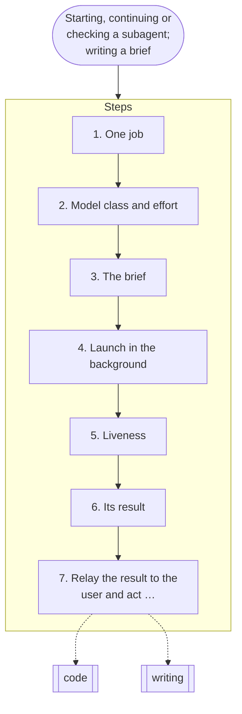
```mermaid
flowchart TB
  start(["Starting, continuing or<br/>checking a subagent;<br/>writing a brief"])
  subgraph g0["Steps"]
    s0["1. One job"]
    s1["2. Model class and effort"]
    s0 --> s1
    s2["3. The brief"]
    s1 --> s2
    s3["4. Launch in the background"]
    s2 --> s3
    s4["5. Liveness"]
    s3 --> s4
    s5["6. Its result"]
    s4 --> s5
    s6["7. Relay the result to the<br/>user and act …"]
    s5 --> s6
  end
  s6 -.-> r1[["code"]]
  s6 -.-> r2[["writing"]]
  start --> g0
```

## A rule failed or the user names a failure; a 👎; editing a skill, prompt or rules file; a `### FOLLOW-UP`; the steward's tick

Opens `mergeworthy:rules` (fix the instance, then the rule or an issue for the steward (6 steps)).

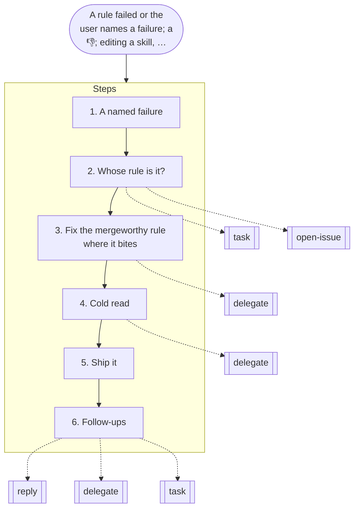
```mermaid
flowchart TB
  start(["A rule failed or the<br/>user names a failure; a<br/>👎; editing a skill, …"])
  subgraph g0["Steps"]
    s0["1. A named failure"]
    s1["2. Whose rule is it?"]
    s0 --> s1
    s2["3. Fix the mergeworthy rule<br/>where it bites"]
    s1 --> s2
    s3["4. Cold read"]
    s2 --> s3
    s4["5. Ship it"]
    s3 --> s4
    s5["6. Follow-ups"]
    s4 --> s5
  end
  s1 -.-> r1[["task"]]
  s1 -.-> r2[["open-issue"]]
  s2 -.-> r3[["delegate"]]
  s3 -.-> r4[["delegate"]]
  s5 -.-> r5[["reply"]]
  s5 -.-> r6[["delegate"]]
  s5 -.-> r7[["task"]]
  start --> g0
```

## Posting or editing anything on GitHub (a step sends you here)

Opens `mergeworthy:post` (draft, lint, review to `CLEAN`, re-check, post (5 steps)).

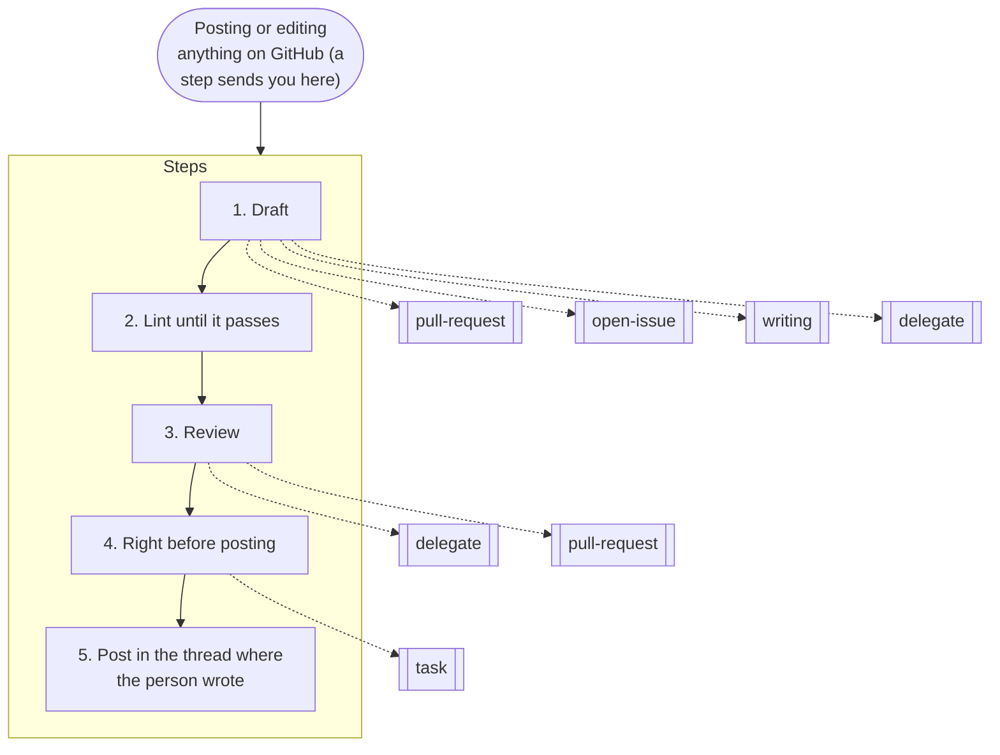
```mermaid
flowchart TB
  start(["Posting or editing<br/>anything on GitHub (a<br/>step sends you here)"])
  subgraph g0["Steps"]
    s0["1. Draft"]
    s1["2. Lint until it passes"]
    s0 --> s1
    s2["3. Review"]
    s1 --> s2
    s3["4. Right before posting"]
    s2 --> s3
    s4["5. Post in the thread where<br/>the person wrote"]
    s3 --> s4
  end
  s0 -.-> r1[["pull-request"]]
  s0 -.-> r2[["open-issue"]]
  s0 -.-> r3[["writing"]]
  s0 -.-> r4[["delegate"]]
  s2 -.-> r5[["delegate"]]
  s2 -.-> r6[["pull-request"]]
  s3 -.-> r7[["task"]]
  start --> g0
```

## Converging a PR's head before it is ready (a step sends you here)

Opens `mergeworthy:converge` (Loop A, Loop B, Loop A again, the fresh reader, gates (6 steps)).

```mermaid
flowchart TB
  start(["Converging a PR's head<br/>before it is ready (a<br/>step sends you here)"])
  subgraph g0["Steps"]
    s0["0. The shape is agreed and<br/>the area is …"]
    s1["1. Loop A"]
    s0 --> s1
    s2["2. Loop B"]
    s1 --> s2
    s3["3. Loop A again"]
    s2 --> s3
    s4["4. The fresh reader"]
    s3 --> s4
    s5["5. Gates and body"]
    s4 --> s5
  end
  s0 -.-> r1[["design"]]
  s0 -.-> r2[["finality"]]
  s1 -.-> r3[["delegate"]]
  s1 -.-> r4[["task"]]
  s2 -.-> r5[["code"]]
  s2 -.-> r6[["delegate"]]
  s2 -.-> r7[["writing"]]
  s3 -.-> r8[["delegate"]]
  s4 -.-> r9[["pull-request"]]
  s4 -.-> r10[["task"]]
  s4 -.-> r11[["delegate"]]
  s4 -.-> r12[["rules"]]
  s4 -.-> r13[["post"]]
  s5 -.-> r14[["merging"]]
  s5 -.-> r15[["post"]]
  s5 -.-> r16[["finality"]]
  s5 -.-> r17[["code"]]
  start --> g0
```

## Verifying a bug or a PR: does it break anything, reproduce-only

Opens `mergeworthy:converge` (step 1 (Loop A), with `delegate/verifier.md`).

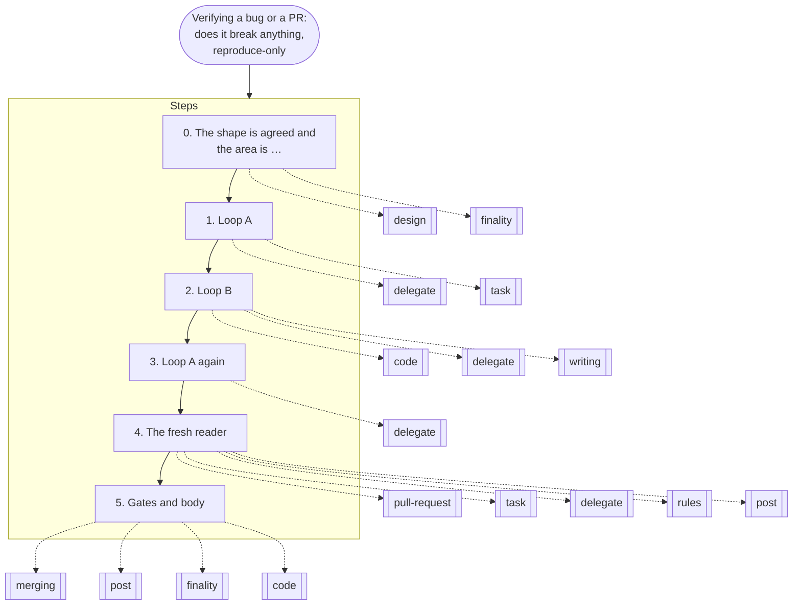
```mermaid
flowchart TB
  start(["Verifying a bug or a PR:<br/>does it break anything,<br/>reproduce-only"])
  subgraph g0["Steps"]
    s0["0. The shape is agreed and<br/>the area is …"]
    s1["1. Loop A"]
    s0 --> s1
    s2["2. Loop B"]
    s1 --> s2
    s3["3. Loop A again"]
    s2 --> s3
    s4["4. The fresh reader"]
    s3 --> s4
    s5["5. Gates and body"]
    s4 --> s5
  end
  s0 -.-> r1[["design"]]
  s0 -.-> r2[["finality"]]
  s1 -.-> r3[["delegate"]]
  s1 -.-> r4[["task"]]
  s2 -.-> r5[["code"]]
  s2 -.-> r6[["delegate"]]
  s2 -.-> r7[["writing"]]
  s3 -.-> r8[["delegate"]]
  s4 -.-> r9[["pull-request"]]
  s4 -.-> r10[["task"]]
  s4 -.-> r11[["delegate"]]
  s4 -.-> r12[["rules"]]
  s4 -.-> r13[["post"]]
  s5 -.-> r14[["merging"]]
  s5 -.-> r15[["post"]]
  s5 -.-> r16[["finality"]]
  s5 -.-> r17[["code"]]
  start --> g0
```

## A shape pass: cut, reshape and rate a diff; a `### SHAPE STALE` event

Opens `mergeworthy:converge` (step 2 (Loop B), with `delegate/shape.md`).

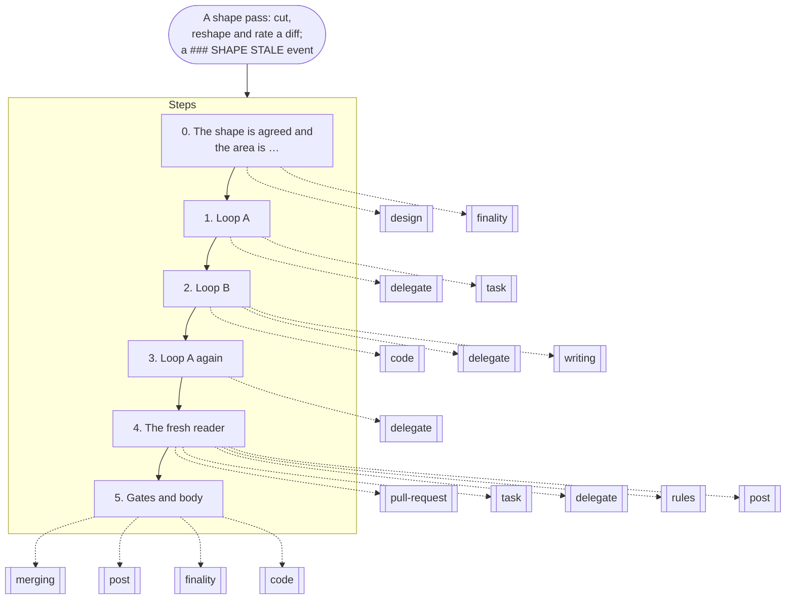
```mermaid
flowchart TB
  start(["A shape pass: cut,<br/>reshape and rate a diff;<br/>a ### SHAPE STALE event"])
  subgraph g0["Steps"]
    s0["0. The shape is agreed and<br/>the area is …"]
    s1["1. Loop A"]
    s0 --> s1
    s2["2. Loop B"]
    s1 --> s2
    s3["3. Loop A again"]
    s2 --> s3
    s4["4. The fresh reader"]
    s3 --> s4
    s5["5. Gates and body"]
    s4 --> s5
  end
  s0 -.-> r1[["design"]]
  s0 -.-> r2[["finality"]]
  s1 -.-> r3[["delegate"]]
  s1 -.-> r4[["task"]]
  s2 -.-> r5[["code"]]
  s2 -.-> r6[["delegate"]]
  s2 -.-> r7[["writing"]]
  s3 -.-> r8[["delegate"]]
  s4 -.-> r9[["pull-request"]]
  s4 -.-> r10[["task"]]
  s4 -.-> r11[["delegate"]]
  s4 -.-> r12[["rules"]]
  s4 -.-> r13[["post"]]
  s5 -.-> r14[["merging"]]
  s5 -.-> r15[["post"]]
  s5 -.-> r16[["finality"]]
  s5 -.-> r17[["code"]]
  start --> g0
```

## The fresh read of a PR before it is ready, as its maintainer

Opens `mergeworthy:converge` (step 4, with `delegate/fresh-reader.md`).

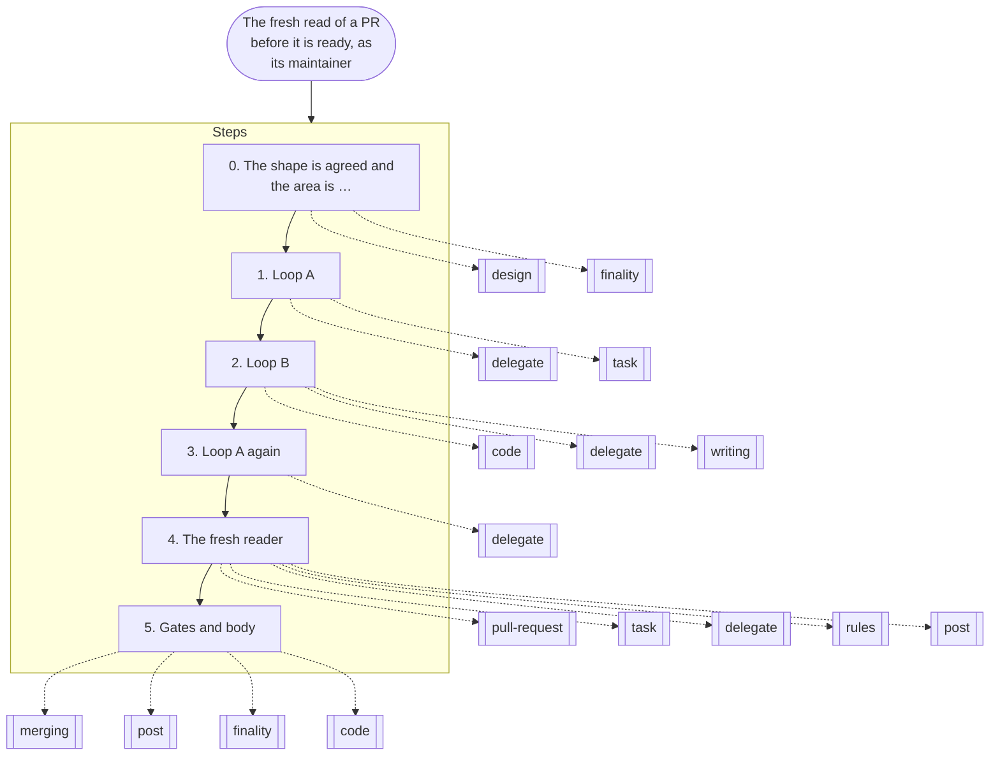
```mermaid
flowchart TB
  start(["The fresh read of a PR<br/>before it is ready, as<br/>its maintainer"])
  subgraph g0["Steps"]
    s0["0. The shape is agreed and<br/>the area is …"]
    s1["1. Loop A"]
    s0 --> s1
    s2["2. Loop B"]
    s1 --> s2
    s3["3. Loop A again"]
    s2 --> s3
    s4["4. The fresh reader"]
    s3 --> s4
    s5["5. Gates and body"]
    s4 --> s5
  end
  s0 -.-> r1[["design"]]
  s0 -.-> r2[["finality"]]
  s1 -.-> r3[["delegate"]]
  s1 -.-> r4[["task"]]
  s2 -.-> r5[["code"]]
  s2 -.-> r6[["delegate"]]
  s2 -.-> r7[["writing"]]
  s3 -.-> r8[["delegate"]]
  s4 -.-> r9[["pull-request"]]
  s4 -.-> r10[["task"]]
  s4 -.-> r11[["delegate"]]
  s4 -.-> r12[["rules"]]
  s4 -.-> r13[["post"]]
  s5 -.-> r14[["merging"]]
  s5 -.-> r15[["post"]]
  s5 -.-> r16[["finality"]]
  s5 -.-> r17[["code"]]
  start --> g0
```

## Pushing, saying a PR is ready, merging

Opens `mergeworthy:merging` (push, ready check, ready, merge (4 steps)).

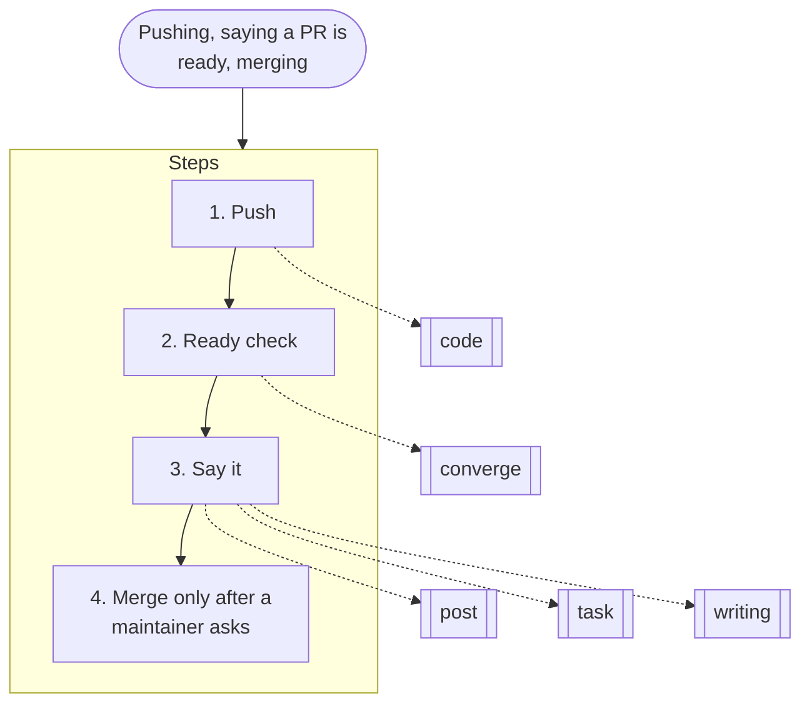
```mermaid
flowchart TB
  start(["Pushing, saying a PR is<br/>ready, merging"])
  subgraph g0["Steps"]
    s0["1. Push"]
    s1["2. Ready check"]
    s0 --> s1
    s2["3. Say it"]
    s1 --> s2
    s3["4. Merge only after a<br/>maintainer asks"]
    s2 --> s3
  end
  s0 -.-> r1[["code"]]
  s1 -.-> r2[["converge"]]
  s2 -.-> r3[["post"]]
  s2 -.-> r4[["task"]]
  s2 -.-> r5[["writing"]]
  start --> g0
```

## Showing a behavior: a reproduction, a screenshot, a video, an upload

Opens `mergeworthy:evidence` (browser, reproduce as a person, capture, upload (5 steps)).

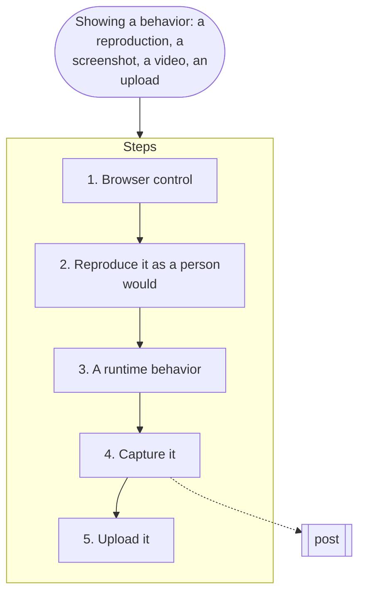
```mermaid
flowchart TB
  start(["Showing a behavior: a<br/>reproduction, a<br/>screenshot, a video, an<br/>upload"])
  subgraph g0["Steps"]
    s0["1. Browser control"]
    s1["2. Reproduce it as a person<br/>would"]
    s0 --> s1
    s2["3. A runtime behavior"]
    s1 --> s2
    s3["4. Capture it"]
    s2 --> s3
    s4["5. Upload it"]
    s3 --> s4
  end
  s3 -.-> r1[["post"]]
  start --> g0
```

## Code drifted through many patches; a design thread drifted; stuck with every option costing something ruled out; asked for the ideal design

Opens `mergeworthy:finality` (map, imagine, hunt, converge, close (7 steps)).

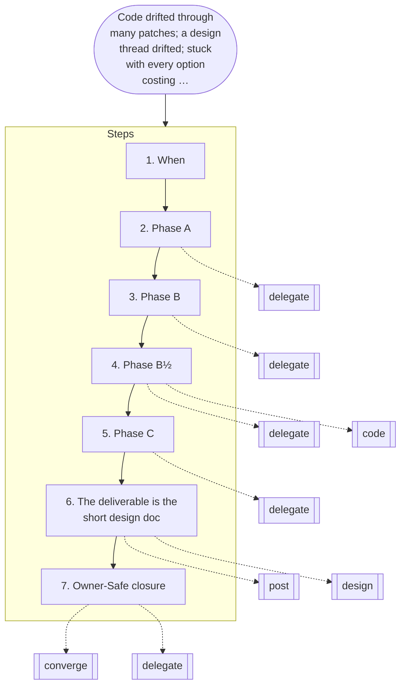
```mermaid
flowchart TB
  start(["Code drifted through<br/>many patches; a design<br/>thread drifted; stuck<br/>with every option<br/>costing …"])
  subgraph g0["Steps"]
    s0["1. When"]
    s1["2. Phase A"]
    s0 --> s1
    s2["3. Phase B"]
    s1 --> s2
    s3["4. Phase B½"]
    s2 --> s3
    s4["5. Phase C"]
    s3 --> s4
    s5["6. The deliverable is the<br/>short design doc"]
    s4 --> s5
    s6["7. Owner-Safe closure"]
    s5 --> s6
  end
  s1 -.-> r1[["delegate"]]
  s2 -.-> r2[["delegate"]]
  s3 -.-> r3[["delegate"]]
  s3 -.-> r4[["code"]]
  s4 -.-> r5[["delegate"]]
  s5 -.-> r6[["post"]]
  s5 -.-> r7[["design"]]
  s6 -.-> r8[["converge"]]
  s6 -.-> r9[["delegate"]]
  start --> g0
```

## Before writing any words a person reads: a post, a body, a report to the user

Opens `mergeworthy:writing` (the standard for words; its Self-check is what the review checks).

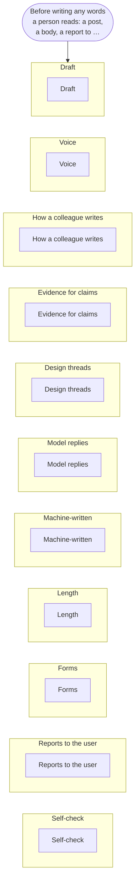
```mermaid
flowchart TB
  start(["Before writing any words<br/>a person reads: a post,<br/>a body, a report to …"])
  subgraph g0["Draft"]
    s0["Draft"]
  end
  subgraph g1["Voice"]
    s1["Voice"]
  end
  subgraph g2["How a colleague writes"]
    s2["How a colleague writes"]
  end
  subgraph g3["Evidence for claims"]
    s3["Evidence for claims"]
  end
  subgraph g4["Design threads"]
    s4["Design threads"]
  end
  subgraph g5["Model replies"]
    s5["Model replies"]
  end
  subgraph g6["Machine-written"]
    s6["Machine-written"]
  end
  subgraph g7["Length"]
    s7["Length"]
  end
  subgraph g8["Forms"]
    s8["Forms"]
  end
  subgraph g9["Reports to the user"]
    s9["Reports to the user"]
  end
  subgraph g10["Self-check"]
    s10["Self-check"]
  end
  start --> g0
  g0 ~~~ g1
  g1 ~~~ g2
  g2 ~~~ g3
  g3 ~~~ g4
  g4 ~~~ g5
  g5 ~~~ g6
  g6 ~~~ g7
  g7 ~~~ g8
  g8 ~~~ g9
  g9 ~~~ g10
```

## Before writing or judging code, tests or comments

Opens `mergeworthy:code` (the standard for code; its Checklist is what the shape pass checks).

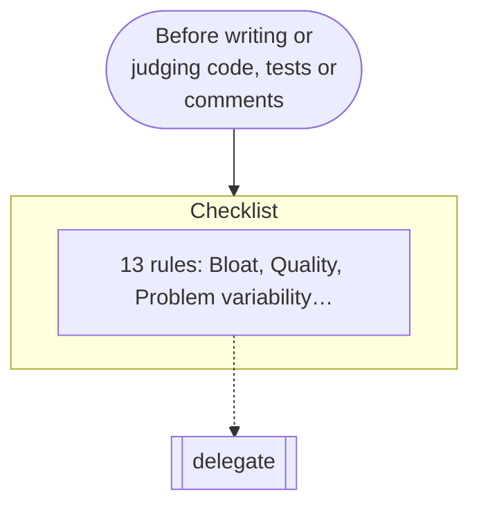
```mermaid
flowchart TB
  start(["Before writing or<br/>judging code, tests or<br/>comments"])
  subgraph g0["Checklist"]
    s0["13 rules: Bloat, Quality, Problem variability…"]
  end
  s0 -.-> r1[["delegate"]]
  start --> g0
```
